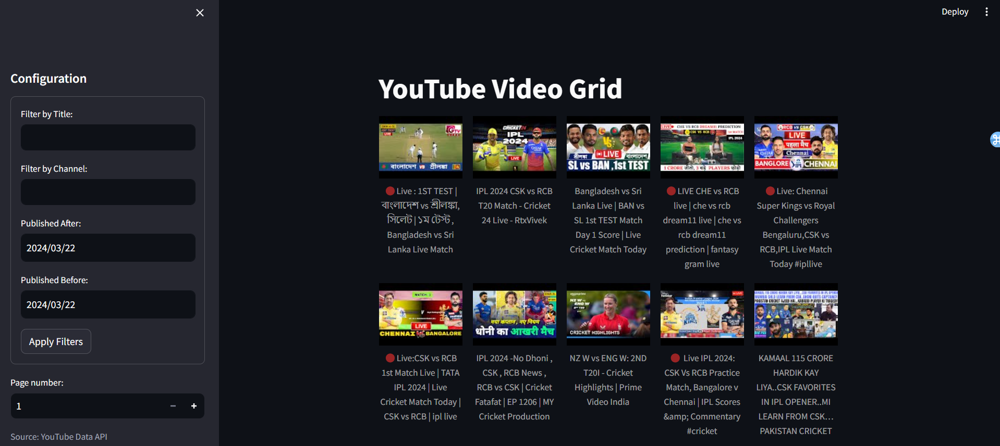
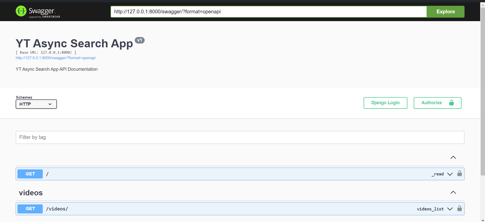

## YouTube Async Search Application

This is a simple application that allows you to search for YouTube videos asynchronously. It uses the YouTube API to fetch the search results and display them on the page. The application is built using Django REST framework and Streamlit. Celery is used to handle the asynchronous tasks i.e. for polling the API after every <strong>10</strong> seconds.
Containarized using Docker.

### Requirements
1. Docker Desktop

### Installation

1. Clone the repository
```bash
git clone https://github.com/atharvabhide/YT-Async-Search-App
cd YT-Aysnc-Search-App
```

2. Create a `.env` file in the root directory and add the following environment variables (use the .env.example for reference)
```bash
GOOGLE_API_KEY=<your_google_api_key>
```

3. Build the Docker images
```bash
./run.sh start-dev
```

4. Open the backend application in your browser (Swagger and Redoc documentation available)
```bash
http://localhost:8000/swagger
http://localhost:8000/redoc
```

5. Open the frontend application in your browser
```bash
pip install -r dev-requirements.txt
streamlit run app.py
http://localhost:8501
```

6. To stop the application
```bash
./run.sh stop-dev
```

7. To interact with the backend shell
```bash
./run.sh interactive-dev
```

### Screenshots
1. Dashboard


<br>

2. API Documentation (Swagger)

